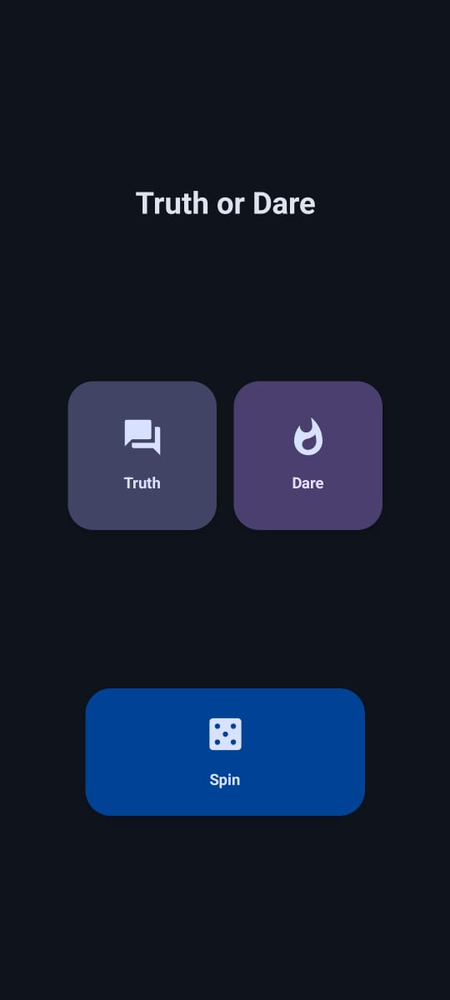
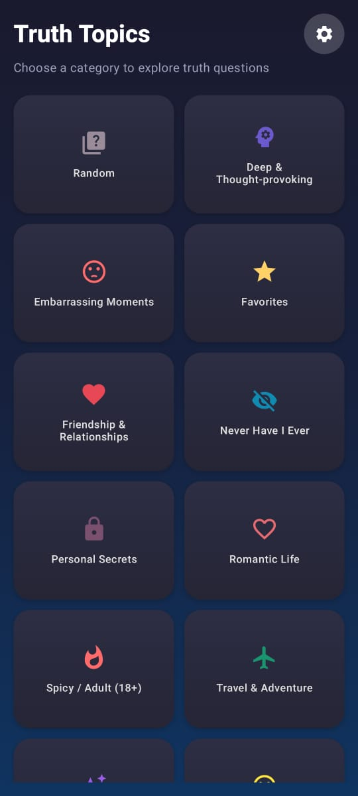
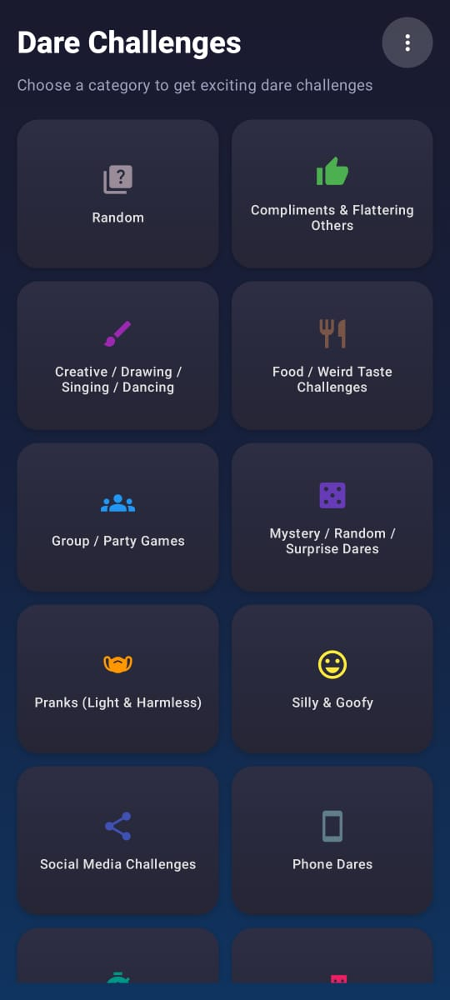
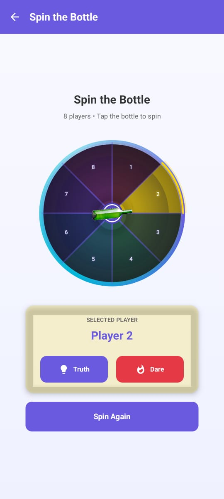

# 🎉 TnD – Truth or Dare Game

**TnD** is an Android app built with **Kotlin + Jetpack Compose** that brings the classic **Truth or Dare** experience to life.  
It includes **Truth questions**, **Dare challenges**, and a fun **Spin the Bottle** mini-game — all with a sleek Material 3 UI.

---

## ✨ Features

- 🗨️ **Truth Mode**  
  - 15+ categories: funny, deep, spicy, embarrassing, etc.
- 🎯 **Dare Mode**  
  - Creative, social, and adventurous challenges.
- 🍾 **Spin the Bottle**  
  - Realistic spinning animation for 2–12 players.
- ⭐ **Feedback Screen**  
  - Rate the app and leave suggestions.
- 🎨 **Modern UI**  
  - Built with Material Design 3 and smooth Compose animations.

---

## 🛠️ Tech Stack

- **Kotlin**  
- **Jetpack Compose** (UI)  
- **Material Design 3**  
- **Navigation-Compose**  
- **MVVM Architecture** with State Hoisting  
- **Compose Animation APIs**

---

## 📸 Screenshots

> *(Add screenshots/GIFs of your app here)*

| Home Screen | Truth Categories | Dare Screen |
|-------------|-----------------|-------------|
|  |  |  |

| Spin the Bottle | Feedback | Feedback |
|-----------------|-----------| -----------|
|  |  |  |

---

## 🚀 Getting Started

Follow these steps to set up the project locally:

1. **Clone the repo**
   ```bash
   git clone https://github.com/keshavparvat11/TnD.git
   cd TnD

2. **Open in Android Studio**

   * Use **Android Studio Giraffe (or newer)**.
   * Make sure you have **Android SDK 21+** installed.

3. **Run the project**

   * Connect a device/emulator.
   * Click **Run ▶** in Android Studio.

---

## 📂 Project Structure

```
📦 com.example.tnd
 ┣ 📂 screen
 ┃ ┣ 📂 Truth          # Truth questions & categories
 ┃ ┣ 📂 Dare           # Dare challenges
 ┃ ┣ 📂 SpinBottle     # Bottle game & player input
 ┃ ┣ 📂 Feedback       # Rating & comments
 ┃ ┗ 📂 Developer      # About the author
 ┣ 📂 model            # Data models (TruthData, DareData, etc.)
 ┣ 📂 navigation       # App navigation (TnDApp)
 ┣ 📂 theme            # AppTheme & colors
 ┗ MainActivity.kt     # Entry point
```

---

## 🔮 Roadmap

* 🌐 Multi-language support
* ☁️ Cloud sync for questions
* 📝 Custom truth/dare creation
* 🎵 Sound effects & music
* 🌙 Dark theme

---


## 👨‍💻 Author

**Keshav Parvat**
[GitHub](https://github.com/keshavparvat11) · [LinkedIn](https://www.linkedin.com/in/keshavparvat/)

> *“Truth or Dare, reimagined for Android.”*


This version is now clean, properly formatted, and ready to display well on GitHub.

If you want, I can also create a **more visual, GitHub-ready README with badges, colors, and styled sections** like top trending repositories have. That would make it look professional.  

Do you want me to do that next?
```
